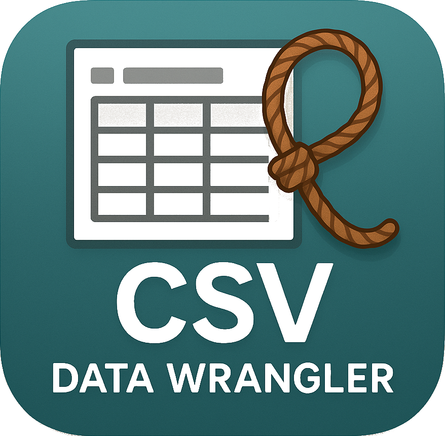

# CSV Data Wrangler



**CSV Data Wrangler** to aplikacja do zarządzania danymi tabelarycznymi w formacie CSV, napisana w Javie z wykorzystaniem Swing. Program umożliwia wczytywanie, edycję, filtrowanie i zapisywanie plików CSV z różnymi separatorami.

## Funkcje

✔ **Operacje na plikach**:
- Wczytywanie plików CSV
- Zapisywanie do nowych plików
- Wykrywanie separatora (przecinek, średnik, tabulator)
- Obsługa nagłówków

✔ **Edycja danych**:
- Dodawanie nowych wierszy
- Usuwanie istniejących wierszy
- Edycja komórek bezpośrednio w tabeli

✔ **Filtrowanie i sortowanie**:
- Filtrowanie po kolumnach (zawiera, równa się, zaczyna się)
- Czyszczenie filtrów
- Sortowanie danych

✔ **Zarządzanie widokiem**:
- Ukrywanie i pokazywanie kolumn
- Dostosowywanie szerokości kolumn

## Wymagania systemowe

- Java Runtime Environment (JRE) 11 lub nowszy
- System operacyjny: Windows/Linux/macOS
- Minimalna rozdzielczość: 1024x768

## Instalacja

1. Pobierz najnowszą wersję programu [tutaj](#)
2. Wypakuj plik ZIP
3. Uruchom plik `CSVWrangler.jar`

```bash
java -jar CSVWrangler.jar